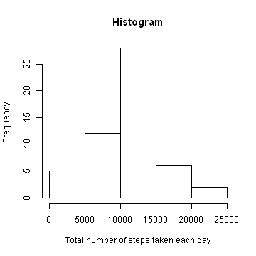
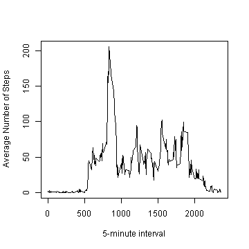
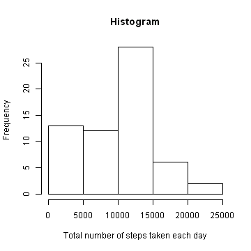
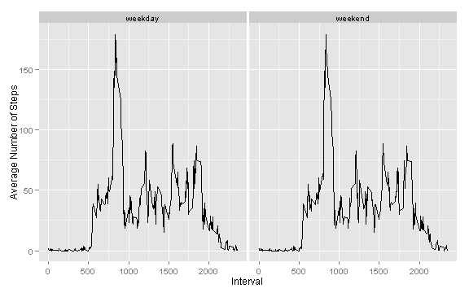

Peer Assessment 1 Report
========================================================

### Loading and preprocessing the data

The given original data was loaded as follows:

```r
setwd("C:/Documents and Settings/user/Desktop/Reproducible Research/PeerAssessments")

data <- read.csv("activity.csv")  # Loading the data 
str(data)
```

```
## 'data.frame':	17568 obs. of  3 variables:
##  $ steps   : int  NA NA NA NA NA NA NA NA NA NA ...
##  $ date    : Factor w/ 61 levels "2012-10-01","2012-10-02",..: 1 1 1 1 1 1 1 1 1 1 ...
##  $ interval: int  0 5 10 15 20 25 30 35 40 45 ...
```

```r
head(data)
```

```
##   steps       date interval
## 1    NA 2012-10-01        0
## 2    NA 2012-10-01        5
## 3    NA 2012-10-01       10
## 4    NA 2012-10-01       15
## 5    NA 2012-10-01       20
## 6    NA 2012-10-01       25
```

Now, the new data excluding missing values (NAs) were obtained as follows and it contains 15,264 rows


```r
good <- complete.cases(data)
dat <- data[good, ]  # Excluding the missing values in the dataset
str(dat)
```

```
## 'data.frame':	15264 obs. of  3 variables:
##  $ steps   : int  0 0 0 0 0 0 0 0 0 0 ...
##  $ date    : Factor w/ 61 levels "2012-10-01","2012-10-02",..: 2 2 2 2 2 2 2 2 2 2 ...
##  $ interval: int  0 5 10 15 20 25 30 35 40 45 ...
```

```r
head(dat)
```

```
##     steps       date interval
## 289     0 2012-10-02        0
## 290     0 2012-10-02        5
## 291     0 2012-10-02       10
## 292     0 2012-10-02       15
## 293     0 2012-10-02       20
## 294     0 2012-10-02       25
```


### Mean total number of steps taken per day

We now used the data without the missing values to draw histogram of the total number of steps taken per day. And, also calculate and report the mean and median total number of steps taken each day.


```r
# Histogram of the total number of steps taken each day
tot_steps <- aggregate(dat$steps ~ dat$date, FUN = sum, na.rm = TRUE)
tot_steps[, 2] <- sapply(tot_steps[, 2], as.numeric)
colnames(tot_steps) <- c("Date", "Total Number of Steps")
head(tot_steps)
```

```
##         Date Total Number of Steps
## 1 2012-10-02                   126
## 2 2012-10-03                 11352
## 3 2012-10-04                 12116
## 4 2012-10-05                 13294
## 5 2012-10-06                 15420
## 6 2012-10-07                 11015
```

```r
hist(tot_steps[, 2], xlab = "Total number of steps taken each day", ylab = "Frequency", 
    main = "Histogram")
```

 

```r

# The mean total number of steps taken per day
mean(tot_steps[, 2])
```

```
## [1] 10766
```

```r
# The median total number of steps taken per day
median(tot_steps[, 2])
```

```
## [1] 10765
```


### The average daily activity pattern

Next, we make a time series plot of the 5-minute interval on the "x-axis" and the average number of steps taken, averaged across all days on the "y-axis". Also, we obtain which of the 5-minute interval, on average across all the days in the dataset, that contains the maximum number of steps.


```r
# Average number of steps taken, averaged across all days
ave_steps <- aggregate(dat$steps ~ dat$interval, FUN = mean)
colnames(ave_steps) <- c("5-minute interval", "Average Number of Steps")
head(ave_steps)
```

```
##   5-minute interval Average Number of Steps
## 1                 0                 1.71698
## 2                 5                 0.33962
## 3                10                 0.13208
## 4                15                 0.15094
## 5                20                 0.07547
## 6                25                 2.09434
```

```r
plot(ave_steps, type = "l")
```

 

```r

# 5-minute interval, on average across all the days, that contains the
# maximum number of steps
d <- which.max(ave_steps[, 2])
ave_steps[, 1][d]
```

```
## [1] 835
```


### Inputing missing values

The total number of missing values in the dataset (i.e. the total number of rows with NAs) is 2,304 and we obtained it as follows:

```r
bad <- data[!good, ]  # Dataset with missing values
# Total number of rows with NAs
nrow(bad)
```

```
## [1] 2304
```


The strategy that I used for obtaining another dataset that is equal to the original dataset but with the missing data replaced, is by calculating the median of the steps in the good original dataset and filling it in to replace the NAs.


```r
median(data$steps, na.rm = TRUE)  # median of steps in the original dataset excluding NAs
```

```
## [1] 0
```

```r

data$steps[is.na(data$steps)] <- median(data$steps, na.rm = TRUE)
ndat <- data  # New dataset
str(ndat)
```

```
## 'data.frame':	17568 obs. of  3 variables:
##  $ steps   : num  0 0 0 0 0 0 0 0 0 0 ...
##  $ date    : Factor w/ 61 levels "2012-10-01","2012-10-02",..: 1 1 1 1 1 1 1 1 1 1 ...
##  $ interval: int  0 5 10 15 20 25 30 35 40 45 ...
```

```r
head(ndat)
```

```
##   steps       date interval
## 1     0 2012-10-01        0
## 2     0 2012-10-01        5
## 3     0 2012-10-01       10
## 4     0 2012-10-01       15
## 5     0 2012-10-01       20
## 6     0 2012-10-01       25
```

```r

# Histogram of the total number of steps taken each day for new dataset
tot_steps <- aggregate(ndat$steps ~ ndat$date, FUN = sum)
tot_steps[, 2] <- sapply(tot_steps[, 2], as.numeric)
colnames(tot_steps) <- c("Date", "Total Number of Steps")
head(tot_steps)
```

```
##         Date Total Number of Steps
## 1 2012-10-01                     0
## 2 2012-10-02                   126
## 3 2012-10-03                 11352
## 4 2012-10-04                 12116
## 5 2012-10-05                 13294
## 6 2012-10-06                 15420
```

```r
hist(tot_steps[, 2], xlab = "Total number of steps taken each day", ylab = "Frequency", 
    main = "Histogram")
```

 

```r

# The mean total number of steps taken per day for new dataset
mean(tot_steps[, 2])
```

```
## [1] 9354
```

```r
# The median total number of steps taken per day for new dataset
median(tot_steps[, 2])
```

```
## [1] 10395
```

From the above results, we noticed that the new values obtained for both mean and median differ from the estimates obtained  in the first part of the assignment expecially the mean values. In the first part, mean = 10766, median = 10765 while the new values for mean = 9354, median = 10395. So, there is a great impact of inputing missing data on the estimates of the total daily number of steps.

### Differences in activity patterns between weekdays and weekends

As we observed in the time series plot below, there are very little differences in activity patterns between weekdays and weekends.


```r
# New factor variable in the dataset with two levels - 'weekday' and
# 'weekend' is created as follows:
days <- c(as.Date(ndat$date))
nvar <- weekdays(days) == "Sunday" | weekdays(days) == "Saturday"
nvar <- factor(nvar, labels = c("weekday", "weekend"))
is.factor(nvar)
```

```
## [1] TRUE
```

```r
levels(nvar)
```

```
## [1] "weekday" "weekend"
```

```r

# New dataset after including the new factor variable
nndat <- data.frame(ndat$steps, ndat$date, ndat$interval, nvar)
str(nndat)
```

```
## 'data.frame':	17568 obs. of  4 variables:
##  $ ndat.steps   : num  0 0 0 0 0 0 0 0 0 0 ...
##  $ ndat.date    : Factor w/ 61 levels "2012-10-01","2012-10-02",..: 1 1 1 1 1 1 1 1 1 1 ...
##  $ ndat.interval: int  0 5 10 15 20 25 30 35 40 45 ...
##  $ nvar         : Factor w/ 2 levels "weekday","weekend": 1 1 1 1 1 1 1 1 1 1 ...
```

```r

ave_steps <- aggregate(ndat$steps ~ ndat$interval, FUN = mean)
head(ave_steps)
```

```
##   ndat$interval ndat$steps
## 1             0    1.49180
## 2             5    0.29508
## 3            10    0.11475
## 4            15    0.13115
## 5            20    0.06557
## 6            25    1.81967
```

```r

ave <- ave_steps[, 2]
head(ave)
```

```
## [1] 1.49180 0.29508 0.11475 0.13115 0.06557 1.81967
```

```r

dd <- data.frame(ndat$steps, ndat$date, ndat$interval, ave, nvar)
head(dd)
```

```
##   ndat.steps  ndat.date ndat.interval     ave    nvar
## 1          0 2012-10-01             0 1.49180 weekday
## 2          0 2012-10-01             5 0.29508 weekday
## 3          0 2012-10-01            10 0.11475 weekday
## 4          0 2012-10-01            15 0.13115 weekday
## 5          0 2012-10-01            20 0.06557 weekday
## 6          0 2012-10-01            25 1.81967 weekday
```

```r

library(ggplot2)
```

```
## Warning: package 'ggplot2' was built under R version 3.0.3
```

```r
library(plyr)
```

```
## Warning: package 'plyr' was built under R version 3.0.3
```

```r
ggplot(dd, aes(ndat$interval, ave, group = nvar)) + geom_line() + xlab("Interval") + 
    ylab("Average Number of Steps") + facet_wrap(~nvar)
```

 

